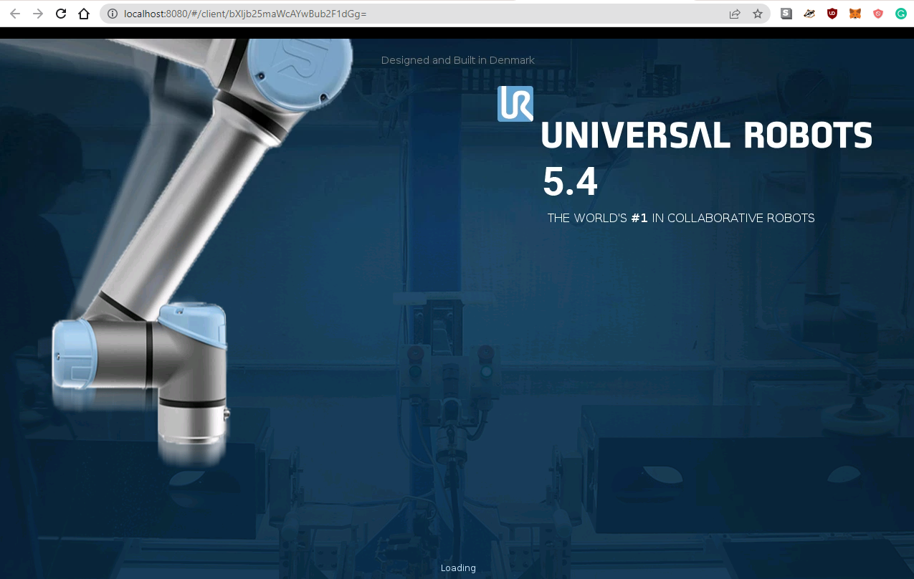
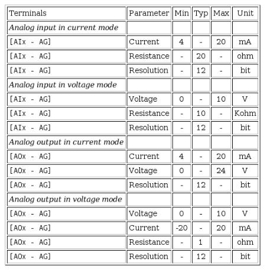
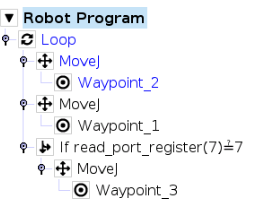
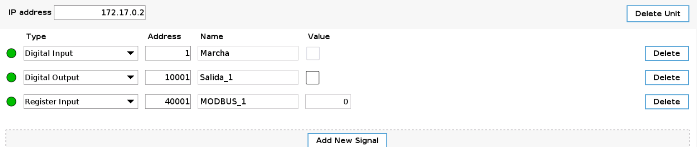

# DockURSim

## A URSim (Universal Robots Simulator) Docker Container with a Browser Accessible Interface

Runs URSim in a docker container with the Polyscope Interface accessible via a browser.

This is a suitable alternative to using the URSim virtual machine image on windows.

**Current URSim Version: 5.4.2.76197**

## Example Usage

First create volume to store robot configuration.

```bash
docker volume create dockursim
```

Start URSim with an UR5 robot and all interface ports exposed.

```bash
docker run -d \
    --name="dockursim" \
    -e ROBOT_MODEL=UR5 \
    -p 8080:8080 \
    -p 29999:29999 \
    -p 30001-30004:30001-30004 \
    -v /path/to/mount/program/folder:/ursim/programs \
    -v dockursim:/ursim \
    --privileged \
    --cpus=1 \
    registry.git.unav.edu:443/daim/remedy/ursim-kafka-lml/docker_ursim:v0.1
```

The Universal Robot Interface can now be accessed at http://localhost:8080.

|                          |
:-------------------------:|
  |

**Ctrl-Alt-Shft** will open a menu that allows changing input options, as well as controlling the clipboard.

**NOTE!** This container requires running with ```--privileged``` set due to pthread spawn issues that couldnt be solved in any other way. This has security implications so DO NOT expose this container to the internet without doing your due diligence first.
**Use this container at your own risk**.

**NOTE Number 2!** I highly recommend running this container with the ```--cpus=1``` option as the container seems to use all available machine resources otherwise and this will likely cause your simulator container (and possibly your computer) to become unresponsive or slow.

## Parameters

Container is configured using parameters passed at runtime.

|       Parameter       | Function                                                                                   |
| :-------------------: | ------------------------------------------------------------------------------------------ |
|  `-e ROBOT_TYPE=UR5`  | Specify robot model to use in URSim. Valid options are UR3, UR5 and UR10. Defaults to UR5. |
| `-e TZ=Europe/London` | Specify a timezone to use e.g. Europe/London                                               |
|    `-e PUID=1000`     | Set UserID                                                                                 |
|    `-e PGID=1000`     | Set GroupID                                                                                |
|      `-v /ursim`      | The URSim application directory                                                            |
|    `-v /programs`     | The UR programs directory. This is accessible within the robot interface                   |
|       `-p 8080`       | Allows HTTP access to the robot interface. (Required for Browser Viewing)                  |
|       `-p 3389`       | Allows RDP access to the robot interface. (Optional. For VNC Viewers)                      |
|       `-p 502`        | Universal Robots Modbus Port. (Optional)                                                   |
|      `-p 29999`       | Universal Robots Dashboard Server Interface Port. (Optional)                               |
|      `-p 30001`       | Universal Robots Primary Interface Port. (Optional)                                        |
|      `-p 30002`       | Universal Robots Secondary Interface Port. (Optional)                                      |
|      `-p 30003`       | Universal Robots Real-time Interface Port. (Optional)                                      |
|      `-p 30004`       | Universal Robots RTDE Interface Port. (Optional)                                           |

The volume and port parameters are separated by a colon and indicate `<external>:<internal>` respectively. For example, `-p 8080:80` would expose port `80` from inside the container to be accessible from the host's IP on port `8080` outside the container.

------

This container was built in my free time to aid with research work. Please feel free to open any issues.

**All rights of the offline simulator application belong to [Universal Robots A/S](https://www.universal-robots.com).**

## Operational limits

### Robot Limits

|       Limit           | Normal             |
| :-------------------: | -------------------|
|  `Power`              | 300W               |
|  `Momentum`           | 25.0 kg m/s        |
|  `Stopping Time`      | 400 ms             |
|  `Stopping Distance`  | 500 mm             |
|  `Tool Speed`         | 1500 mm/s          |
|  `Tool Force`         | 150.0 N            |
|  `Elbow Speed`        | 1500 mm/s          |
|  `Elbow Force`        | 150.0 N            |

### Joints

|       Joint           | Position {Min/Max} | Max. Speed |
| :-------------------: | -------------------|----------- |
|  `Base`               | [-363:363]º        | 191º/s     |
|  `Shoulder`           | [-363:363]º        | 191º/s     |
|  `Elbow`              | [-363:363]º        | 191º/s     |
|  `Wrist 1`            | [-363:363]º        | 191º/s     |
|  `Wrist 2`            | [-363:363]º        | 191º/s     |
|  `Wrist 3`            | [-363:363]º        | 191º/s     |

## Analog inputs specs

	|

## Robot Program

Moves the arm between the two firs waypoints, when the modbus attacker triggers the if, another waypoint is added to the movement:

	

## Configurando las entradas digitales

1. We access the robot's interface through its url: http://localhost:8080

2. Start the robot and switch to the Installation menu at the top of the screen.

3. Access the Fieldbus menu on the left and select Modbus.

4. In the Modbus menu, add a new unit by clicking on the Add Modbus Unit button.

5. Once we have the unit, we change the ip 0.0.0.0.0 for the ip of our robot, and we add 3 signals by pressing the Add New Signal button 3 times.

6. Fill in the signs as shown in the image below.:

	


>**Note:** If the leds on the left are not green, it means that the robot's ip is not connected to the signals.
