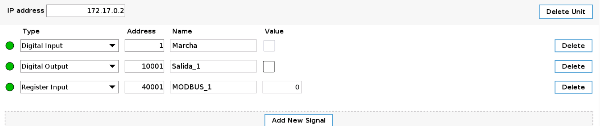

# Digital Input Configurations

1. We access the robot's interface through its url: http://localhost:8080

2. Start the robot and switch to the Installation menu at the top of the screen.

3. Access the Fieldbus menu on the left and select Modbus.

4. In the Modbus menu, add a new unit by clicking on the Add Modbus Unit button.

5. Once we have the unit, we change the ip 0.0.0.0.0 for the ip of our robot, and we add 3 signals by pressing the Add New Signal button 3 times.

6. Fill in the signs as shown in the image below.:

>**Note:** If the leds on the left are not green, it means that the robot's ip is not connected to the signals.