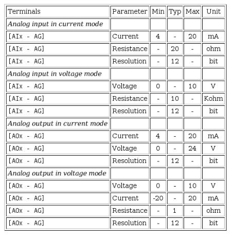

# Operational limits

## Robot Limits

|       Limit           | Normal             |
| :-------------------: | -------------------|
|  `Power`              | 300W               |
|  `Momentum`           | 25.0 kg m/s        |
|  `Stopping Time`      | 400 ms             |
|  `Stopping Distance`  | 500 mm             |
|  `Tool Speed`         | 1500 mm/s          |
|  `Tool Force`         | 150.0 N            |
|  `Elbow Speed`        | 1500 mm/s          |
|  `Elbow Force`        | 150.0 N            |

## Joints

|       Joint           | Position {Min/Max} | Max. Speed |
| :-------------------: | -------------------|----------- |
|  `Base`               | [-363:363]º        | 191º/s     |
|  `Shoulder`           | [-363:363]º        | 191º/s     |
|  `Elbow`              | [-363:363]º        | 191º/s     |
|  `Wrist 1`            | [-363:363]º        | 191º/s     |
|  `Wrist 2`            | [-363:363]º        | 191º/s     |
|  `Wrist 3`            | [-363:363]º        | 191º/s     |

## Analog inputs specs

|
